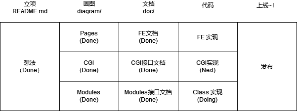

# Ai Dictionary
（WIP）基于AI的可对话的超级英语字典~！

## 目标

本项目目标有二：

1. 打造一个可对话的超级英语字典网站
2. 一行代码也不写，纯粹使用AI来完整整站开发！

## 实现思路

## 产品设计

| 模块         | 功能拆分                 | 备注                                                         |      |
| ------------ | ------------------------ | ------------------------------------------------------------ | ---- |
| 字典模块     | 用户提交词，生成页面     | 判断合理生成缓存定期push                                     | P0   |
|              | 围绕这个词进行对话       | 问答可能不会采用自由问答，比如提供固定句式，如多个词对比，句子纠错或者由GPT判断是否展示 | P0   |
|              | 围绕某个对话进行追加对话 |                                                              | P2   |
| 词对比模块   |                          | 和字典模块相同可以后期会扫字典模块对话，进行关联             | P1   |
| 句子纠错模块 | 提交句子                 |                                                              | P2   |
|              | 归类问题                 | 这个主要靠feed推荐了                                         | P2   |
| 角色         | 默认角色，猫娘           |                                                              | P0   |
|              | 提供女性向角色           | 感觉会导致大量重复或许可以只有一个源，然后调用3.5把4的内容进行润色女性学英语的多，提高下优先级 | P1   |
|              | 自定义角色？             | 同上                                                         | ？   |
|              | 多语言                   | 同上                                                         | P2   |
| 社群         | 账号系统                 | 可以用来控制流量，但是一开始没必要做                         | P2   |
|              | Feed                     | 一期可以只做好实现的，比如新旧，类似于贴吧的机制             | P0   |
|              | 页面反馈机制             | 让用户点赞或反对？                                           | ？   |
|              | 举报机制                 | 违规内容或单纯的内容质量不好？                               | P1   |

## 技术设计

| 模块          | 包含元素           | 实现细节                                                     |      |      |      |
| ------------- | ------------------ | ------------------------------------------------------------ | ---- | ---- | ---- |
| 页面 /        | Feed 推荐          | 一期先弄个新旧提交成功时把内容推到队列里 interA: type: word调用个 renderURL 模块来根据 interA 来渲染URL 渲出来<a> |      |      |      |
|               | 提交框             |                                                              |      |      |      |
| 提交词        | 首次提交           | 检测是否存在？咋检测，得分类要不然检测不出来，先判断分类，再找？判断是否合理？好像没必要，可以判断同义词，然后放在正文里怎么控制竞争 加个中间态好了，然后有个超时机制，15min 只是同时打开然后读取流吗？可以但没必要，加个轮训就好了 |      |      |      |
|               | 提交缓存           | 可以有个分类： 单个单词 动词短语 固定搭配没必要上数据库，内存数据即可生成md文件，cache/:type/id.md 要生成词简介，需要一句话简介和一段话简介 |      |      |      |
|               | 命中缓存           | { id: word }的内存缓存，每次载入的时候要过一遍。可能会花好多时间。。。 |      |      |      |
|               | 更新缓存           | 提供刷新按钮，只有Prompts有变动后才提供刷新，然后重新生成提供 down vote？ |      |      |      |
| /word/:id     | 渲染               | 动态渲染比较好添加快捷链接？prompts里面加上好像就行服务器动态markdown |      |      |      |
|               | 命中竞争           | 轮训，然后跳转或者干脆不要轮训好了                           |      |      |      |
| header        | 搜索框             |                                                              |      |      |      |
| openai        |                    |                                                              |      |      |      |
| /api/word/:id | 根据id返回精准数据 |                                                              |      |      |      |
| /api/search   | 返回搜索结果       |                                                              |      |      |      |

 
